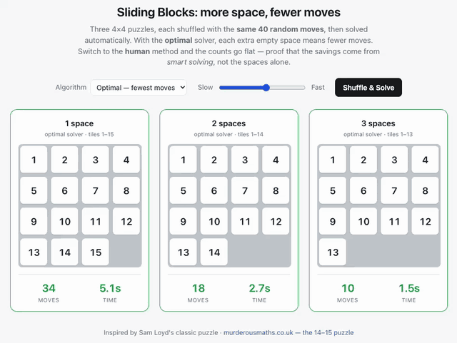

# Sliding Blocks: more space, fewer moves

Three 4×4 sliding-block puzzles side by side — with **1, 2, and 3 blank spaces** — each
shuffled with the same 40 random moves and then solved automatically, with live move and
time counters.

> **Why this exists:** built alongside the article
> [**Using AI to Call Bullshit On Yourself**](https://www.rickmanelius.com/p/using-ai-to-call-bullshit-on-yourself)
> — on using AI to actually *test* a hunch instead of trusting it. The hunch here was that
> more empty space would make a sliding puzzle dramatically faster to solve. It turned out
> to be directionally right but far less dramatic than expected. The numbers below are what
> that looks like when you check.

**[▶ Live demo](https://rickmanelius.github.io/sliding-blocks-demo/)**



The question it explores: *does giving a sliding puzzle more empty space make it faster to
solve?* The honest answer turned out to be more interesting than the tidy story.

---

## Two solvers, one dropdown

The **Algorithm** dropdown switches all three boards between:

| Algorithm | What it does | Result |
| --- | --- | --- |
| **Optimal** | A\* search with a Manhattan-distance + linear-conflict heuristic (admissible, so it returns a genuinely *shortest* solution) | Move counts **fall** as spaces are added |
| **Human** | Layer-by-layer method: top row, second row, then the bottom two rows column by column, finishing with a 2×2 rotation | Move counts stay **flat** (~75–80) |

That contrast is the real lesson. The human method uses a single working space and ignores
the spare holes entirely, so extra space buys it nothing. The savings don't come from the
empty squares — they come from a solver smart enough to exploit them.

> In Human mode on the 2- and 3-space boards, a few counted moves look invisible: the spare
> hole is being shuffled around like a tile. That's honest — it's real work the method does.

## What the numbers actually say

Single runs are noisy, so `tools/simulate.js` measures the distributions directly.
**1,200 shuffles per board**, shuffle depth 40, optimal solver, seed `12345`:

```
board      mean    sd   min   p25   med   p75   max
-------------------------------------------------------
1 space    31.3   4.7    14    28    32    34    40
2 spaces   20.3   4.6     6    18    20    24    36
3 spaces   18.2   4.3     4    16    18    22    32
```

How often the descending "ladder" actually holds on a **single** shuffle:

| Comparison | Holds |
| --- | --- |
| 1 space > 2 spaces | **93%** |
| 2 spaces > 3 spaces | **57%** (tied 13%) |
| Full ladder 1 > 2 > 3 | **50%** |

### The takeaway

**The first extra hole roughly halves the work. The second one barely matters.**

Going from 1 → 2 spaces saves ~11 moves against a spread of ~4.7 — a large, reliable
effect that holds 93% of the time. Going from 2 → 3 spaces saves only ~2 moves against a
spread of ~4.5, so the signal is *smaller than the noise*: it's close to a coin flip, and
the full three-rung ladder appears only about half the time. If you reload the demo and
the third board doesn't beat the second, that's not a bug — that's the actual distribution.

A 5×5 grid was tested too, on the theory that a bigger board might widen the gap. It
doesn't: the same shape holds (a big 1 → 2 drop, a negligible 2 → 3 one), and optimal
solving just gets much slower.

## Running it

The demo is a single self-contained `index.html` — no build step, no dependencies:

```bash
open index.html          # or just double-click it
```

Reproduce the statistics (requires Node):

```bash
node tools/simulate.js
node tools/simulate.js --trials=2000 --depth=40 --seed=99
```

The script is seeded, so the default invocation reproduces the table above exactly.

## Implementation notes

- **Always solvable.** Boards are shuffled *from* the solved state with random legal moves,
  so no unsolvable parity cases can occur.
- **The human solver's hard part.** Placing the last two tiles of a row/column one at a time
  deadlocks: the second tile can strand in a degree-1 "pendant" cell, and a single blank
  physically cannot extract it (push the blank in to move the tile out, and the blank is
  trapped). It's fixed by placing each end-pair as a single BFS over the joint
  `(tileA, tileB, blank)` state. Verified across **50,000 random boards with 0 failures**.
- **Why shuffle depth 40?** Deep enough to look thoroughly mixed, shallow enough that
  optimal A\* stays instant in the browser. Fully random shuffles push optimal solving into
  seconds.

## Credit

Inspired by Sam Loyd's classic 14–15 puzzle —
[murderousmaths.co.uk](http://www.murderousmaths.co.uk/games/loyd/loydfr.htm).
